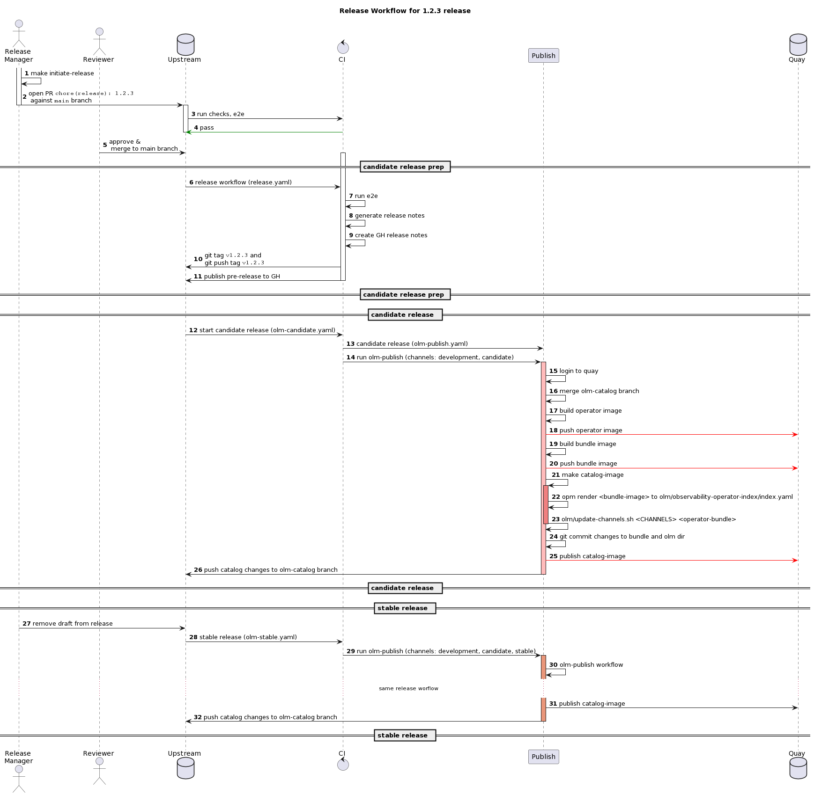

# Release Worflow

## Important pointers

* `olm-catalog` branch is the "release" branch
* Due to the nature of File Based Catalogs, the catalog's [index](https://github.com/rhobs/observability-operator/blob/olm-catalog/olm/observability-operator-index/index.yaml) file
  is stored under  [`olm-catalog` branch](https://github.com/rhobs/observability-operator/tree/olm-catalog)
* `update-channels.sh` script is kept under the [olm directory](https://github.com/rhobs/observability-operator/blob/olm-catalog/olm/update-channels.sh)

## Release Workflow

NOTE: the source for the UML can be found under [assets directory](./assets/release.uml)
