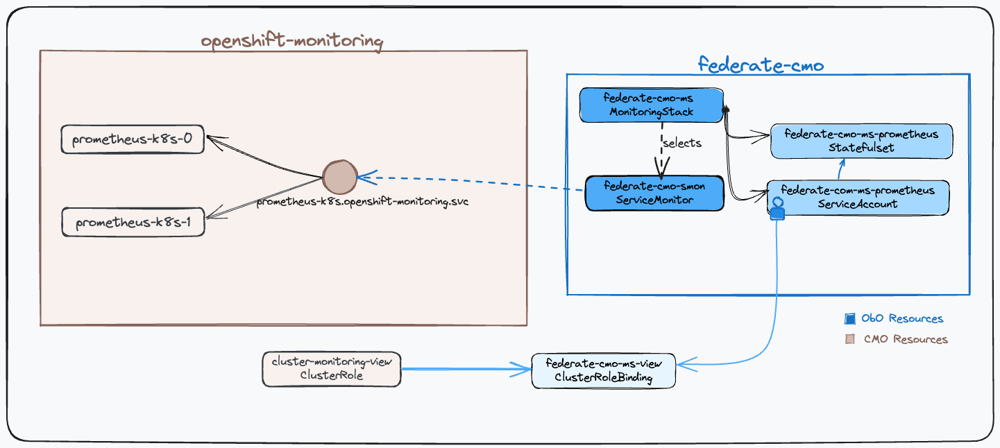

# Federate Monitoring Stack and Openshift In-Cluster Prometheus

## Architecture / Topology



This example deploys a MonitoringStack in the `federate-cmo` namespace and ingests
only a selected set of metrics from the in-cluster Prometheus stack.

## Steps

Assuming that the Observability Operator is installed, follow the steps below to create a
MonitoringStack that uses the in-cluster Prometheus `/federate` endpoint to
scrape selected metrics.

**NOTE:** All examples used in this guide can be found under the [manifests
directory](federation/manifests)

### Create a Project to deploy MonitoringStack

```yaml
apiVersion: v1
kind: Namespace
metadata:
  name: federate-cmo
```

Or run

```sh
kubectl apply -f docs/user-guides/federation/manifests/00-ns.yaml
```

### Deploy Monitoring Stack

Apply the following MonitoringStack

```yaml
apiVersion: monitoring.rhobs/v1alpha1
kind: MonitoringStack
metadata:
  name: federate-cmo-ms
  namespace: federate-cmo
spec:
  # 👇 Used to select the ServiceMonitor in the federate-cmo namespace
  #    NOTE: there isn't a need for namespaceSelector
  resourceSelector:
    matchLabels:
      monitoring.rhobs/stack: federate-cmo-ms

  logLevel: info # 👈 use debug for verbose logs
  retention: 3h

  prometheusConfig:
    replicas: 2  # 👈 ensures that at least one prometheus is running during upgrade

  alertmanagerConfig:
    disabled: true

  resources: # 👈 ensure that you provide sufficient amount of resources
    requests:
      cpu: 500m
      memory: 1Gi
```

Or run

```sh
kubectl apply -f docs/user-guides/federation/manifests/10-ms.yaml
```

### Grant Permission to Federate In-Cluster Prometheus

```yaml
apiVersion: rbac.authorization.k8s.io/v1
kind: ClusterRoleBinding
metadata:
  name: federate-cmo-ms-view
  labels:
    kubernetes.io/part-of: federate-cmo-ms
    monitoring.rhobs/stack: federate-cmo-ms

roleRef:
  apiGroup: rbac.authorization.k8s.io
  kind: ClusterRole
  name: cluster-monitoring-view
subjects:
- kind: ServiceAccount
  # 👇 ServiceAccount used in the prometheus deployed by ObO.
  #    SA name follows <monitoring stack name>-prometheus nomenclature
  name: federate-cmo-ms-prometheus
  namespace: federate-cmo
```

Or run

```sh
kubectl apply -f docs/user-guides/federation/manifests/11-crb.yaml
```

### Create ServiceMonitor for Federation

```yaml
apiVersion: monitoring.rhobs/v1
kind: ServiceMonitor
metadata:
  name: federate-cmo-smon
  namespace: federate-cmo
  labels:
    kubernetes.io/part-of: federate-cmo-ms
    monitoring.rhobs/stack: federate-cmo-ms

spec:
  selector: # 👈 use the prometheus service to create a "dummy" target.
    matchLabels:
      app.kubernetes.io/managed-by: observability-operator
      app.kubernetes.io/name: federate-cmo-ms-prometheus

  endpoints:
  - params:
      'match[]': # 👈 scrape only required metrics from in-cluster prometheus
        - '{__name__=~"container_cpu_.*", namespace="federate-cmo"}'
        - '{__name__="container_memory_working_set_bytes", namespace="federate-cmo"}'

    relabelings:
    # 👇 relabel example
    - targetLabel: source
      replacement: my-openshift-cluster

    # 👇 override the target's address by the prometheus-k8s service name.
    - action: replace
      targetLabel: __address__
      replacement: prometheus-k8s.openshift-monitoring.svc:9091

    # 👇 remove the default target labels as they aren't relevant in case of federation.
    - action: labeldrop
      regex: pod|namespace|service|endpoint|container

    # 👇 30s interval creates 4 scrapes per minute
    #    prometheus-k8s.svc x 2 ms-prometheus x (60s/ 30s) = 4
    interval: 30s

    # 👇 ensure that the scraped labels are preferred over target's labels.
    honorLabels: true

    port: web
    scheme: https
    path: "/federate"

    bearerTokenFile: /var/run/secrets/kubernetes.io/serviceaccount/token

    tlsConfig:
      serverName: prometheus-k8s.openshift-monitoring.svc
      ca:
        configMap: # 👈 automatically created by serving-ca operator
          key: service-ca.crt
          name: openshift-service-ca.crt
```

Or run

```sh
kubectl apply -f docs/user-guides/federation/manifests/20-smon-cmo.yaml
```

## Validation

Verify that the MonitoringStack resource is available:

```sh
kubectl wait --for=condition=Available -n federate-cmo --timeout=10s monitoringstacks federate-cmo-ms
```

You can verify if the setup works by using either the Prometheus UI or by inspecting
`<prometheus>/api/v1/targets`.

### Prometheus UI

Access Prometheus UI by port-forwarding the `federate-cmo-ms-prometheus`
service created by the Observability Operator as follows

```sh
kubectl port-forward svc/federate-cmo-ms-prometheus 9090:9090 --address 0.0.0.0 -n federate-cmo

# open: http://localhost:9090/targets
```

### Inspect `api/v1/targets`

Run the following command to inspects all active targets for `federate-cmo-smon`
service

```sh
kubectl exec -n federate-cmo -it sts/prometheus-federate-cmo-ms -- \
    curl -s 'http://localhost:9090/api/v1/targets?state=active' |
    jq '.data.activeTargets[]| select(.scrapePool | contains("federate-cmo-smon"))| .labels'
```

The above should return the following JSON:

```json
{
  "instance": "prometheus-k8s.openshift-monitoring.svc:9091",
  "job": "federate-cmo-ms-prometheus",
  "source": "my-openshift-cluster"
}
```
