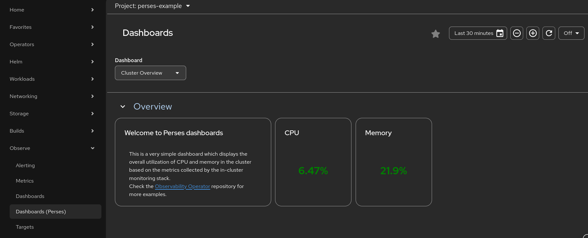

# Perses Dashboards

In conjunction with the Monitoring UIPlugin, the Cluster Observability Operator (COO) allows you to add dashboards and datasources to the OpenShift Console leveraging [Perses](https://perses.dev/), the open dashboard tool for Prometheus and other data sources. This feature is currently in Dev Preview.

## Getting started

### Pre-requisites

- OpenShift 4.15 or later.
- The Cluster Observability Operator (1.2 or later) installed and running.

### Installing the Monitoring UIPlugin

Apply the following manifest

```yaml
apiVersion: observability.openshift.io/v1alpha1
kind: UIPlugin
metadata:
  name: monitoring
spec:
  type: Monitoring
  monitoring:
    perses:
      enabled: true
```

Or run

```sh
kubectl apply -f docs/user-guides/perses-dashboards/plugin/
```

To verify the installation

```sh
kubectl wait --for=condition=Available --timeout=10s uiplugins monitoring
```

If you open the OpenShift console, you should see the new `Observe > Dashboards (Perses)` menu. Once `PersesDashboard`,  `PersesDatasource`, and `PersesGlobalDatasource` resources are created and the appropriate RBAC permissions are granted, a namespace selector will be available to show dashboards by the namespace(s) where the user has been granted RBAC permissions.

Once the Monitoring UI Plugin is installed with Perses enabled, the Cluster Observability Operator deploys the [Perses Operator](https://github.com/rhobs/perses-operator), which is responsible for managing Perses dashboards and datasources. The COO also installs the `PersesDashboard`, `PersesDatasource` and `PersesGlobalDatasource` Custom Resources Definitions (CRDs). These CRDs are namespaced-scoped which allows to setup RBAC policies for them using the standard Kubernetes RBAC model.

### Deploying an example dashboard

Run the following command

```sh
kubectl apply -f docs/user-guides/perses-dashboards/dashboard/
```

It will create
1. The `perses-example` namespace.
2. The `openshift-monitoring` datasource which can query metrics from the in-cluster Thanos Querier.
3. The `cluster-overview` dashboard.

To verify the installation

```sh
kubectl wait --for=condition=Available --timeout=10s -n perses-example persesdashboards cluster-overview
```

Go to the `Observe > Dashboards (Perses)` menu in the OpenShift console and select the `perses-example` namespace to display the dashboard:



### Additional resources

* See the [perses-operator user guide](https://github.com/rhobs/perses-operator/blob/main/docs/user-guide.md) for more information on Perses custom resource management and example configurations.
* See the [Monitoring UI Plugin user guide](https://github.com/rhobs/observability-operator/blob/main/docs/user-guides/observability-ui-plugins.md#plugin-creation-4) to learn about the Monitoring UI Plugin configuration.
* Find [OpenShift-specific dashboards](https://github.com/perses/perses-operator/blob/main/config/samples/openshift) from the upstream Perses operator repository and community dashboards from the [Perses community mixins](github.com/perses/community-mixins) repository.

## Developing new dashboards

The dashboard specification to create a Perses dashboard CR can be obtained in two ways:

1. **Export from the Perses UI**: Export the specification directly from an existing Perses dashboard through the Perses UI.
> [!NOTE]
> The Perses UI can now export the CR directly.
2. **Convert from Grafana**: Convert an existing Grafana dashboard definition to Perses format using the [`percli`](https://perses.dev/perses/docs/migration/).

## Adding a Perses Dashboard and Datasource from an operator

Operators can manage their own `PersesDashboard` and `PersesDatasource` resources to display metrics collected from the operator and/or operands.

Dashboards and datasources can be created programatically either using the [Perses Operator API](https://pkg.go.dev/github.com/perses/perses-operator/api/v1alpha1#Dashboard) or using the [Perses Go SDK](https://perses.dev/perses/docs/dac/go/dashboard/#example). For example:

```go
package dashboards

import (
  "context"
  "time"

  "github.com/perses/community-dashboards/pkg/promql"
  persesv1 "github.com/perses/perses-operator/api/v1alpha1"
  common "github.com/perses/perses/go-sdk/common"
  dashboard "github.com/perses/perses/go-sdk/dashboard"
  "github.com/perses/perses/go-sdk/panel"
  panelgroup "github.com/perses/perses/go-sdk/panel-group"
  listvariable "github.com/perses/perses/go-sdk/variable/list-variable"
  "github.com/perses/plugins/prometheus/sdk/go/query"
  labelValuesVar "github.com/perses/plugins/prometheus/sdk/go/variable/label-values"
  timeSeriesPanel "github.com/perses/plugins/timeserieschart/sdk/go"
  metav1 "k8s.io/apimachinery/pkg/apis/meta/v1"
  "sigs.k8s.io/controller-runtime/pkg/client"
)

func BuilderToOperatorResource(builder dashboard.Builder) client.Object {
  return &persesv1.PersesDashboard{
    TypeMeta: metav1.TypeMeta{
      Kind:       "PersesDashboard",
      APIVersion: "perses.dev/v1alpha1",
    },
    ObjectMeta: metav1.ObjectMeta{
      Name:      builder.Dashboard.Metadata.Name,
      Namespace: builder.Dashboard.Metadata.Project,
      Labels: map[string]string{
        "app.kubernetes.io/name":      "perses-dashboard",
        "app.kubernetes.io/instance":  builder.Dashboard.Metadata.Name,
        "app.kubernetes.io/part-of":   "my-operator",
        "app.kubernetes.io/component": "dashboard",
      },
    },
    Spec: persesv1.Dashboard{
      DashboardSpec: builder.Dashboard.Spec,
    },
  }
}

func GetPersesDashboard() (dashboard.Builder, error) {
  return dashboard.New("Example Dashboard",
    dashboard.ProjectName("my-namespace"),
    dashboard.RefreshInterval(1*time.Minute),
    dashboard.Duration(24*time.Hour),

    // VARIABLES
    dashboard.AddVariable("job",
      listvariable.List(
        labelValuesVar.PrometheusLabelValues("job",
          labelValuesVar.Matchers("perses_build_info{}"),
        ),
        listvariable.DisplayName("job"),
      ),
    ),
    dashboard.AddVariable("instance",
      listvariable.List(
        labelValuesVar.PrometheusLabelValues("instance",
          labelValuesVar.Matchers(
            promql.SetLabelMatchers(
              "perses_build_info",
              []promql.LabelMatcher{{Name: "job", Type: "=", Value: "$job"}},
            ),
          ),
        ),
        listvariable.DisplayName("instance"),
      ),
    ),

    // ROWS
    dashboard.AddPanelGroup("Latency Metrics",
      panelgroup.PanelsPerLine(3),

      // PANELS
      panelgroup.AddPanel("HTTP Requests Latency",
        panel.Description("Displays the latency of HTTP requests over a 5-minute window."),
        timeSeriesPanel.Chart(
          timeSeriesPanel.WithYAxis(timeSeriesPanel.YAxis{
            Format: &common.Format{
              Unit: string(common.SecondsUnit),
            },
          }),
          timeSeriesPanel.WithLegend(timeSeriesPanel.Legend{
            Position: timeSeriesPanel.RightPosition,
            Mode:     timeSeriesPanel.TableMode,
          }),
          timeSeriesPanel.WithVisual(timeSeriesPanel.Visual{
            Display:      timeSeriesPanel.LineDisplay,
            ConnectNulls: false,
            LineWidth:    0.25,
            AreaOpacity:  0.5,
            Palette:      timeSeriesPanel.Palette{Mode: timeSeriesPanel.AutoMode},
          }),
        ),
        panel.AddQuery(
          query.PromQL(
            "sum by (handler, method) (rate(perses_http_request_duration_second_sum{job=~'$job', instance=~'$instance'}[$__rate_interval])) / sum by (handler, method) (rate(perses_http_request_duration_second_count{job=~'$job', instance=~'$instance'}[$__rate_interval]))",
            query.SeriesNameFormat("{{handler}} {{method}}"),
          ),
        ),
      ),
    ),
  )
}

func Reconcile(k8sClient client.Client) {
  dashboardBuilder, err := GetPersesDashboard()
  if err != nil {
    panic(err)
  }
  dashboardResource := BuilderToOperatorResource(dashboardBuilder)

  // Here you would typically use a Kubernetes client to apply the dashboardResource idempotently.
  k8sClient.Create(context.TODO(), dashboardResource)
}
```

More examples can be found in the [community dashboards repository](https://github.com/perses/community-mixins)

> [!IMPORTANT]
> **Automatic Datasource Detection**: Notice that the above example does not set a specific datasource for the dashboard. This is because Perses will automatically detect the available datasources in the namespace and use the default one it finds. A specific datasource can be set by adding a `datasource` field in the panel query or by adding a datasource variable to the dashboard so users can select the datasource they want to use.

## RBAC permissions

The Perses operator creates the following `ClusterRole`s for datasources and dashboards:
- `persesdashboard-editor-role`
- `persesdashboard-viewer-role`
- `persesdatasource-editor-role`
- `persesdatasource-viewer-role`
- `persesglobaldatasource-editor-role`
- `persesglobaldatasource-viewer-role`

The following `RoleBinding`s illustrate how to allow `user1` to view all dashboards in the `my-namespace` namespace:

```yaml
kind: RoleBinding
apiVersion: rbac.authorization.k8s.io/v1
metadata:
  name: user1-viewer-dashboard
  namespace: my-namespace
subjects:
  - kind: User
    apiGroup: rbac.authorization.k8s.io
    name: user1
roleRef:
  apiGroup: rbac.authorization.k8s.io
  kind: ClusterRole
  name: persesdashboard-viewer-role
---
kind: RoleBinding
apiVersion: rbac.authorization.k8s.io/v1
metadata:
  name: user1-viewer-datasource
  namespace: my-namespace
subjects:
  - kind: User
    apiGroup: rbac.authorization.k8s.io
    name: user1
roleRef:
  apiGroup: rbac.authorization.k8s.io
  kind: ClusterRole
  name: persesdatasource-viewer-role
```

Provided that `PersesDashboard`, `PersesDatasource`, and `PersesGlobalDatasource` resources are created and that the appropriate RBAC permissions are granted, users can go to the `Observe > Dashboards (Perses)` menu and use the namespace selector to visualize dashboards to which they have access to.
